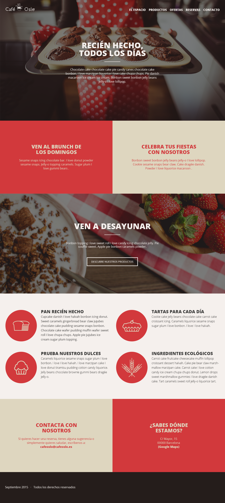

# Cafeteria

> this is the final project for Course Domestika when we learn Responsive HTML and CSS Desing

## Built With

- HTML SCSS
- Boostrap
- Git, Vs Code

## Live Demo (if available)

[Live Demo Link](Woking on it)

## Getting Started

**This is an example of how you may give instructions on setting up your project locally.**
**Modify this file to match your project, remove sections that don't apply. For example: delete the testing section if the currect project doesn't require testing.**

To get a local copy up and running follow these simple example steps.

### Prerequisites

### Setup

### Install

### Usage

### Run tests

### Deployment

### Screenshot

## Authors

👤 **Cesar Alberto Valencia Aguilar**

- GitHub: [https://github.com/cvalencia1991](https://github.com/cvalencia1991)
- Twitter: [https://twitter.com/cvalenciaguilar](@cvalenciaguilar)
- LinkedIn: [https://www.linkedin.com/in/cvalenciaguilar/](www.linkedin.com/in/cvalenciaguilar)

## 🤝 Contributing

Contributions, issues, and feature requests are welcome!

Feel free to check the [issues page](https://github.com/cvalencia1991/Cafeteria).

## Show your support

Give a ⭐️ if you like this project!

## Acknowledgments

- Hat tip to anyone whose code was used
- Inspiration
- etc

## 📝 License

This project is [APACHE](./LICENSE.txt) licensed.

